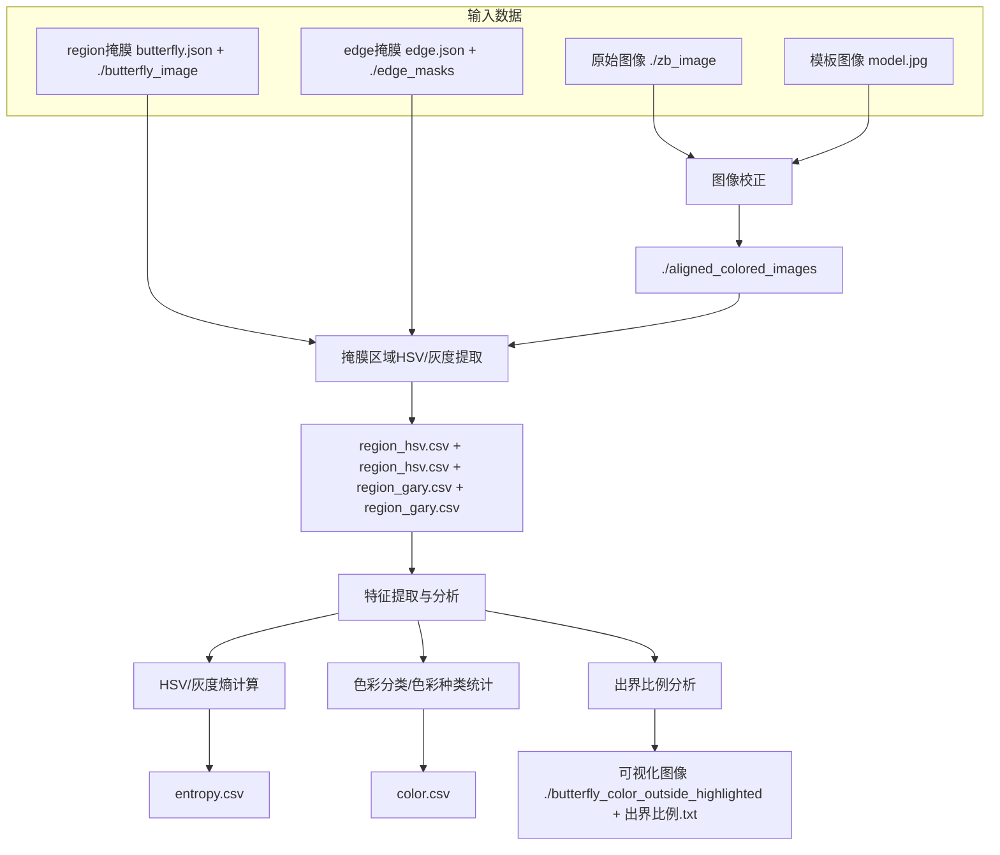

# Color Analysis in Coloring Images
#  图像处理流程说明（以数据集zb为例）

## 🧩 Step 1：图像校正

- 📂 **原始图像路径**：`./zb_image`  
- 📄 **图像命名规则**：`zb_年级_班级_编号.jpg`，例如 `zb_07_03_12.jpg`  
- 🧭 **模板图像**：`model.jpg`，用于对齐校正  
- 🛠️ **校正脚本**：`image_correction.py`  
- 📤 **输出结果**：校正后的图像存储在 `./zb_aligned_colored_images` 文件夹，图像经过模板对齐，颜色校正处理，方便后续分析

---

## 🎯 Step 2：掩膜区域 HSV 提取（基于像素）

- **region 掩膜 JSON 文件**：`butterfly.json`  
- 📂 **region 掩膜图像路径**：`./butterfly_image`  
- **edge 掩膜 JSON 文件**：`edge.json`  
- 📂 **edge 掩膜图像路径**：`./edge_masks`  
- 🛠️ **HSV 提取脚本**：`all_hsv.py`  
- 📤 **输出文件**：
  - region 区域 HSV 数据：`zb_all_hsv_results.csv`  
  - edge 区域 HSV 数据：`zb_all_edge_hsv_results.csv`  
- **说明**：基于掩膜区域逐像素提取 HSV 色彩信息，结果为后续色彩分析基础数据

---

## 🔥 Step 3.1.1：HSV 熵计算

- 🛠️ **脚本**：`entropy_region.py`  
- 📂 **输入数据**：`zb_all_hsv_results.csv`  
- 📤 **输出数据**：`zb_image_entropy_region_results.csv`  
- **说明**：计算每个区域的 HSV 熵值，反映色彩多样性和复杂度

## ⚫ Step 3.1.2：灰度熵计算

- 🛠️ **灰度值提取脚本**：`image_gary_values.py`  
  - 输出：
    - region 区域灰度值：`zb_grayscale_values.csv`  
    - edge 区域灰度值：`zb_edge_grayscale_values.csv`  
- 🛠️ **灰度熵计算脚本**：`gary_entropy.py`  
  - 输入/输出示例（以 lj2 数据为例，实际替换为对应文件）：
    - region：
      - 输入：`zb_grayscale_values.csv`  
      - 输出：`zb_gary_entropy_values.csv`  
    - edge：
      - 输入：`zb_edge_grayscale_values.csv`  
      - 输出：`zb_edge_gary_entropy_values.csv`  
- **说明**：提取图像灰度信息并计算灰度熵，衡量图像明暗复杂度

## 🎨 Step 3.2：色彩分类（基于自定义色彩）

- 🛠️ **region 区域色彩分类脚本**：`main_color.py`  
  - 输入：`zb_all_hsv_results.csv`  
  - 输出：`zb_main_color.csv`，分类结果标明各区域主色  
- 🛠️ **狭窄区间色彩分类脚本（用于统计色彩种类）**：`main_color_number.py`  
  - 输入：`zb_all_hsv_results.csv`  
  - 输出：`zb_main_color_number.csv`  
- 🛠️ **edge 区域色彩分类脚本**：`edge_color.py`  
  - 输入：`zb_all_edge_hsv_results.csv`  
  - 输出：`zb_edge_main_color.csv`  
- **说明**：基于自定义色彩范围对 HSV 数据进行色彩归类，便于统计和分析色彩分布

---

## 🚩 Step 3.3：出界比例分析

- 🛠️ **代码**：`color_outside_lines.py`  
- 📤 **输出**：  
  - 带有高亮标注的出界区域图像  
  - 计算得到的出界比例数据  
- 📂 **高亮图像存储路径**：`./zb_butterfly_color_outside_highlighted`  
- **说明**：检测并高亮颜色出界区域，量化出界面积比例，便于质量控制

---

**使用提示**： 
请确保按顺序依次运行各步骤代码，保持输入输出路径一致，避免文件名冲突，保证数据完整连贯。

📊 **所有 CSV 文件说明汇总**

| CSV 文件名                            | 内容说明                                           | 生成步骤          | 用途/备注                                |
| ------------------------------------- | -------------------------------------------------- | ----------------- | ---------------------------------------- |
| `zb_all_hsv_results.csv`              | 基于 region 掩膜区域逐像素提取的 HSV 色彩数据      | Step 2 HSV 提取   | 色彩分析基础数据，供色彩分类、熵计算使用 |
| `zb_all_edge_hsv_results.csv`         | 基于 edge 掩膜区域逐像素提取的 HSV 色彩数据        | Step 2 HSV 提取   | 边缘区域色彩分析基础数据                 |
| `zb_main_color.csv`                   | region 区域色彩分类结果，标明每个区域的主色        | Step 3 色彩分类   | 色彩统计与分布分析                       |
| `zb_main_color_number.csv`            | region 区域色彩种类数量统计结果                    | Step 3 色彩分类   | 色彩多样性分析                           |
| `zb_edge_main_color.csv`              | edge 区域色彩分类结果                              | Step 3 色彩分类   | 边缘区域色彩分布统计                     |
| `zb_image_entropy_region_results.csv` | region 区域 HSV 熵计算结果，反映色彩多样性和复杂度 | Step 4 HSV 熵计算 | 色彩复杂度量化                           |
| `zb_grayscale_values.csv`             | region 区域灰度值数据                              | Step 5 灰度提取   | 供灰度熵计算使用                         |
| `zb_edge_grayscale_values.csv`        | edge 区域灰度值数据                                | Step 5 灰度提取   | 供边缘灰度熵计算使用                     |
| `zb_gary_entropy_values.csv`          | region 区域灰度熵计算结果，衡量图像明暗复杂度      | Step 5 灰度熵计算 | 明暗复杂度量化                           |
| `zb_edge_gary_entropy_values.csv`     | edge 区域灰度熵计算结果                            | Step 5 灰度熵计算 | 边缘区域明暗复杂度量化                   |

