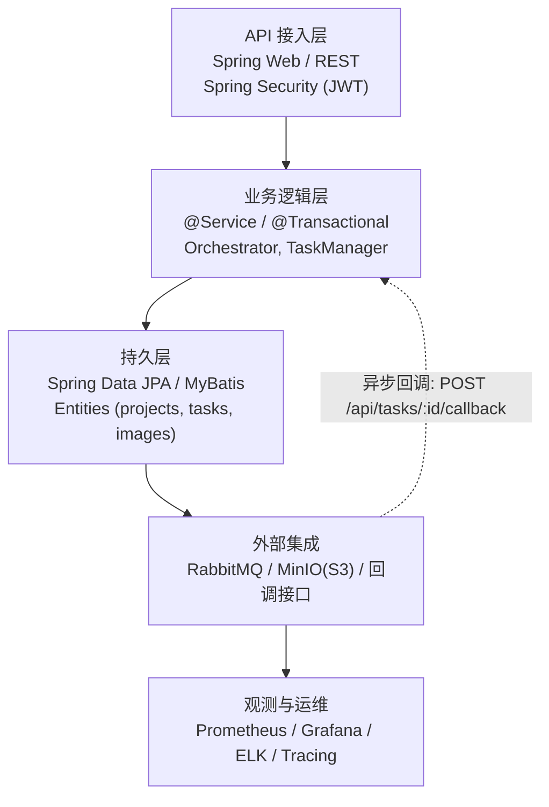
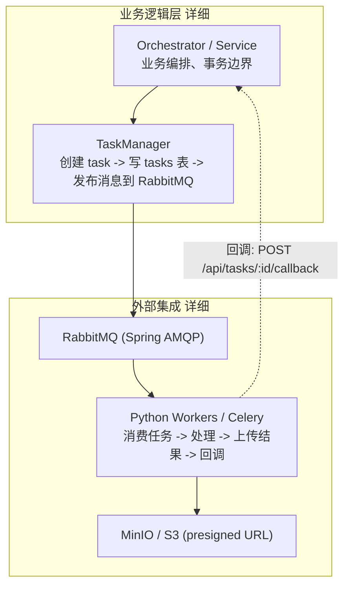

# 后端层级视图（Spring Boot）

下面的文档展示后端内部清晰的模块划分与对应的技术选型，保留层级关系同时最大程度减少箭头交叉，便于阅读与开发分工。

## 目标
- 突出后端各层（API 层、业务层、持久层、外部集成）及其技术选型。
- 保持自上而下布局，减少交叉箭头；把观测/运维放为旁注。

## 后端层级图（更紧凑的堆叠式布局，减少交叉）

为了解决箭头过长与交叉问题，主图采用“按层堆叠”的紧凑布局：每一层作为一个整体节点展示，层与层之间只有一条短连线，避免大量横向连线。需要查看某层内部细节时，可参看下方的“展开视图”。

### 展开视图：后端分层细节（仅展示 Service 与 Integration 内部结构）

## 每层说明与技术选型

- API 接入层（Controller / Gateway）
  - 技术：Spring Web, Spring Security
  - 作用：路由、鉴权、请求校验、速率限制、返回统一化
  - 开发要点：Controller 仅做请求校验与调用 Service；异常映射使用 `@ControllerAdvice`。

- 中间件（Authentication / Middleware）
  - 技术：Spring Security (JWT), HandlerInterceptor/Filter
  - 作用：校验 token、注入 traceId、请求日志与审计点

- 业务逻辑层（Service / Orchestrator / TaskManager）
  - 技术：Spring Boot 服务、`@Service`、事务管理 `@Transactional`
  - 作用：封装业务流程、管理事务边界、实现任务创建与消息发布
  - 开发要点：任务创建建议采用“写 DB -> outbox -> 发布消息”或使用事务性 outbox 模式保证可靠性。

- 持久层（Repository / DAO / Entities）
  - 技术：Spring Data JPA 或 MyBatis
  - 作用：映射数据库表（projects、tasks、images、results），实现分页与复杂查询
  - 开发要点：为常用查询添加索引；重要表使用事务和乐观锁或悲观锁视场景而定。

- 外部集成（Message / ObjectStore / Callback）
  - 技术：RabbitMQ (Spring AMQP), MinIO/AWS S3 SDK
  - 作用：异步任务分发、存储大文件、worker 回调
  - 开发要点：回调实现 HMAC 签名验证＆幂等处理；使用 presigned URL 上传大文件，避免后端代理。

- 观测与运维（旁注）
  - 技术：micrometer, Prometheus, Grafana, ELK/Loki, OpenTelemetry, Sentry
  - 开发要点：埋点 task duration、queue length、api latency；在日志中携带 traceId/taskId。

## 开发实践建议（简短）

- 统一 `params`/`payload` JSON schema 并在 Service 层校验。
- 任务与回调设计为幂等（使用 task id 去重）并记录 `worker_task_id` 以便追踪。
- 使用 Testcontainers 做集成测试（MySQL、RabbitMQ、MinIO）。
- 在关键路径（create task、callback）添加丰富的日志与指标用于运维。

文件路径：`docs/backend_layers.md`
