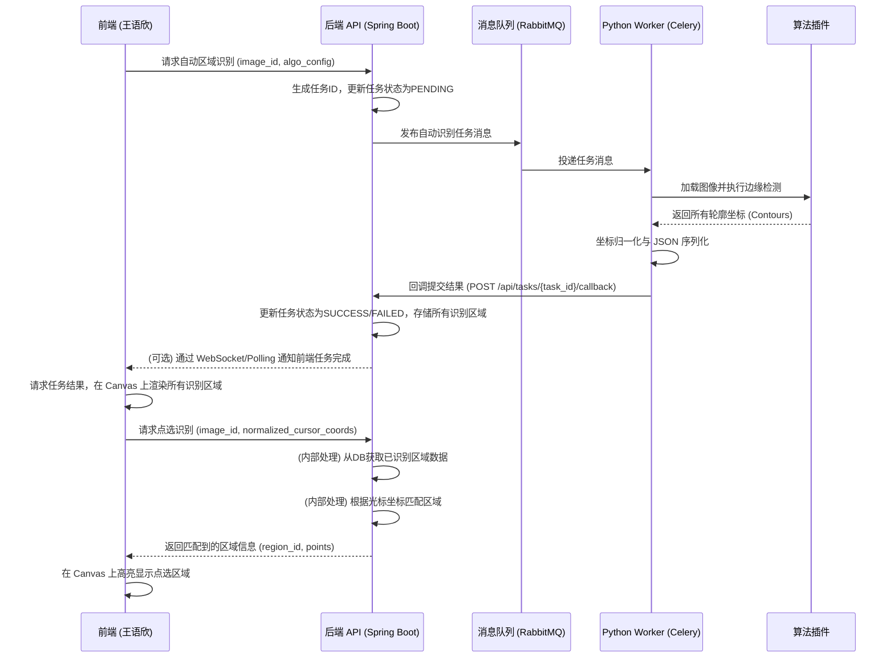

# **区域识别与划分模块设计方案V1.1**

**版本：** V1.1
**日期：** 2026年2月9日
**负责人：** 陈祚垟 (后端/算法), 阮伊铭 (需求/跟进)
**协作人：** 王语欣 (前端交互)

---

## **1. 模块概述**

区域识别与划分模块是系统的核心算法组件，负责在矫正后的图像上识别出感兴趣的分析区域（ROI）。该模块需支持**自动边缘检测**与**基于用户光标坐标的点选识别**，并结合手动微调，为后续的涂色分析提供精确的坐标范围。考虑到图像处理的计算密集性，本模块将采用 **Python Celery Worker** 实现异步处理，以提升系统响应性和吞吐量。

---

## **2. 核心职责与流程**

### **2.1 核心职责**
1.  **图像预处理：** 对输入图像进行灰度化、降噪处理。
2.  **边缘检测：** 根据配置调用不同的算法识别图像轮廓。
3.  **区域提取：** 将闭合轮廓转换为结构化的坐标点集。
4.  **点选识别：** 根据用户提供的光标坐标，在已识别的区域中找出对应的闭合区域。
5.  **掩码生成：** 为后端分析生成二值化掩码（Mask）。

### **2.2 业务流程图 (Mermaid)**



---

## **3. 接口契约设计**

### **3.1 Spring Boot API (自动区域识别任务提交)**

*   **Endpoint:** `POST /api/tasks/region-recognition`
*   **请求体 (Request Body):**
    ```json
    {
      "image_id": "uuid-string",
      "storage_key": "path/to/image.png", // 图像在MinIO中的Key
      "algorithm_config": {
        "method": "CANNY", // 可选: CANNY, SOBEL, SCHARR
        "threshold1": 100,
        "threshold2": 200,
        "gaussian_blur": 5,
        "min_area": 500 // 过滤掉过小的杂质区域
      }
    }
    ```
*   **响应体 (Response Body):**
    ```json
    {
      "task_id": "uuid-of-the-generated-task",
      "status": "PENDING",
      "message": "区域识别任务已提交，请稍后查询结果。"
    }
    ```

### **3.2 Python Celery Worker (自动区域识别任务处理)**

*   **输入 (Input):** 接收来自 RabbitMQ 的任务消息，包含 `image_id`, `storage_key`, `algorithm_config`。
*   **输出 (Output):** 处理完成后，通过 HTTP POST 请求回调 Spring Boot 的 `/api/tasks/{task_id}/callback` 接口，提交所有识别到的区域结果。

### **3.3 Spring Boot API (结果回调 - 自动识别)**

*   **Endpoint:** `POST /api/tasks/{task_id}/callback`
*   **请求体 (Request Body):**
    ```json
    {
      "status": "success", // 或 "failed"
      "result_payload": {
        "regions": [
          {
            "region_id": "r1",
            "type": "polygon",
            "points": [
              {"x": 0.12, "y": 0.34},
              {"x": 0.15, "y": 0.38}
            ],
            "bounding_box": {"x": 0.1, "y": 0.3, "w": 0.05, "h": 0.08}
          }
        ],
        "metadata": {
          "original_width": 1920,
          "original_height": 1080
        }
      },
      "logs": "Optional logs or error messages"
    }
    ```

### **3.4 Spring Boot API (点选识别)**

*   **Endpoint:** `GET /api/images/{image_id}/region/at-point`
*   **请求参数 (Query Parameters):**
    *   `x`: 光标的归一化 X 坐标 (0.0 - 1.0)
    *   `y`: 光标的归一化 Y 坐标 (0.0 - 1.0)
*   **响应体 (Response Body):**
    ```json
    {
      "region_id": "r1",
      "type": "polygon",
      "points": [
        {"x": 0.12, "y": 0.34},
        {"x": 0.15, "y": 0.38}
      ],
      "bounding_box": {"x": 0.1, "y": 0.3, "w": 0.05, "h": 0.08}
    }
    ```
    *   如果未匹配到任何区域，返回空或特定错误码。

> **注意：** 所有坐标点均采用 **0.0 到 1.0 的归一化数值**，以确保在前端不同尺寸的 Canvas 上缩放不失真。

---

## **4. 前后端职责与交互**

### **4.1 后端 (陈祚垟)**
*   **输入：** 图像文件（通过 `storage_key` 从 MinIO 获取），用户光标的归一化坐标。
*   **输出：** 闭合轮廓结构化的坐标点集（JSON 格式，归一化），或点选匹配到的单个区域信息。
*   **任务：**
    1.  实现 Python Celery Worker，负责消费 RabbitMQ 任务，执行自动区域识别。
    2.  封装算法插件，实现图像预处理、边缘检测、区域提取。
    3.  **实现 Spring Boot 内部的区域匹配逻辑：** 在接收到自动识别结果并存储后，能够根据用户提供的光标归一化坐标，高效地从已存储的区域数据中查找并返回对应的区域。
    4.  将处理结果序列化为 JSON，并通过回调接口通知 Spring Boot (自动识别) 或直接返回 (点选识别)。
    5.  确保 Worker 的稳定性和可扩展性，支持任务重试和错误日志记录。

### **4.2 前端 (王语欣)**
*   **输入：** 用户光标坐标（Canvas 相对坐标），缩放比例（用于 Canvas 渲染）。
*   **输出：** 闭合轮廓的 Canvas 显示，高亮显示点选区域。
*   **任务：**
    1.  调研并实现 Canvas 渲染组件，能够根据后端返回的归一化坐标绘制所有识别区域。
    2.  **实现光标事件监听：** 捕获用户在 Canvas 上的点击事件，将 Canvas 坐标转换为归一化坐标。
    3.  **调用点选识别 API：** 将归一化光标坐标发送给 Spring Boot 的点选识别接口。
    4.  根据后端返回的区域信息，在 Canvas 上高亮显示被点选的区域。
    5.  实现用户交互，支持在 Canvas 上进行区域的查看、选择、手动微调（拖拽、缩放）。
    6.  实现任务状态的查询或接收通知，以便在区域识别完成后及时更新界面。

---

## **5. 算法实现细节**

### **5.1 算法解耦设计**
采用策略模式（Strategy Pattern）封装算法：
*   **Canny 策略：** 适用于边缘清晰、对比度高的涂色稿。
*   **Sobel 策略：** 适用于边缘较软、有渐变效果的图像。
*   **自定义策略：** 预留接口支持未来集成基于深度学习（如 Segment Anything Model）的识别。

### **5.2 跟进要点 (兼容性保障)**
1.  **坐标系对齐：** 确认原点 (0,0) 统一为图像左上角。
2.  **数据格式：** 确保 `points` 数组的顺序是顺时针或逆时针，方便前端直接进行 `context.fill()` 操作。
3.  **性能优化：** 针对高分辨率图片，Worker 应先进行等比例缩放处理，识别后再将坐标映射回原图比例。
4.  **点选识别准确性：** 验证在不同缩放比例下，前端点击位置与后端匹配区域的准确性。

---

## **6. 验收标准**

1.  **准确性 (自动识别)：** 对于标准涂色模板，自动识别的区域覆盖率应达到 95% 以上。
2.  **准确性 (点选识别)：** 用户点击图像上任意已识别区域的内部，系统应能准确返回该区域信息。
3.  **一致性：** 同一张图片在多次自动识别下返回的坐标点集应保持一致。
4.  **交互性：** 返回的 JSON 数据应能在王语欣开发的前端组件中无缝加载并支持手动拖拽修改。
5.  **性能 (自动识别)：** 单张图片（例如 1920x1080）的自动区域识别任务，从提交到结果回调，总耗时应在 5 秒内完成。
6.  **性能 (点选识别)：** 单次点选识别请求，从前端发送到后端返回结果，响应时间应在 200ms 内。
