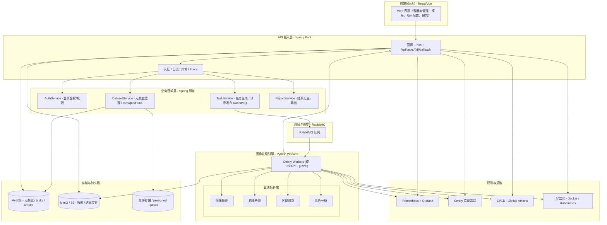

需要做语言间任务/通信设计（Spring ↔ Python），但可用消息队列或 HTTP/gRPC 解决。

---

## 技术选型

- 后端 API：**Java + Spring Boot**（Spring Web, Spring Data JPA / MyBatis, Spring Security + JWT）
- 异步消息 / 调度：**RabbitMQ**（与 Spring AMQP 集成），Python 端使用 **Celery**（或直接使用 kombu）
- Python image workers：**Celery workers**（或独立 Flask/FastAPI + gRPC/HTTP）仅负责图像处理与上载结果
- 数据库：**MySQL（InnoDB，utf8mb4）**（使用 JSON 列支持 config/payload）
- 迁移工具：**Flyway 或 Liquibase**
- 对象存储：**MinIO (S3) 或 AWS S3**
- 容器/部署：**Docker / Kubernetes**
- 监控/日志：Prometheus + Grafana，ELK / Loki，Sentry（错误追踪）
- CI/CD：GitHub Actions / GitLab CI

理由：RabbitMQ 与 Spring 的整合成熟；Celery 可配置使用 RabbitMQ；MySQL 在大多数企业环境更易运维。

---

## 系统集成建议（Spring ↔ Python）

两种模式（优先 1）

1. **消息队列（推荐）**：Spring Boot 将任务消息发布到 RabbitMQ（任务元数据、dataset id、存储 key、模板 id）。Python Celery worker 订阅消费并处理，处理完成后调用 Spring 的 **callback 接口**（HTTP POST /api/tasks/{id}/callback）提交结果摘要与文件引用（object store key）。优点：解耦、可扩展、可监控任务状态。
2. **RPC（可选）**：Spring 通过 gRPC/HTTP 调用 Python 服务来同步处理（适用于低延迟/小任务、但可扩展性不如消息队列）。

推荐：任务发布 → worker 处理 → 上传到 Object Storage → worker 回调 API 更新任务和写入 DB（保证权限和验证）。

---

## 数据库表结构（MySQL）— 核心表（示例建表 SQL）🗄️

说明：使用 CHAR(36) 存储 UUID；config 与 payload 使用 JSON 类型；使用 InnoDB 引擎与 utf8mb4 字符集。

1) users（用户）

```sql
CREATE TABLE users (
  id CHAR(36) PRIMARY KEY,
  username VARCHAR(128) NOT NULL UNIQUE,
  password_hash VARCHAR(255) NOT NULL,
  role VARCHAR(32) DEFAULT 'user',
  created_at TIMESTAMP DEFAULT CURRENT_TIMESTAMP,
  updated_at TIMESTAMP DEFAULT CURRENT_TIMESTAMP ON UPDATE CURRENT_TIMESTAMP
) ENGINE=InnoDB DEFAULT CHARSET=utf8mb4;
```

2) datasets（数据集）

```sql
CREATE TABLE datasets (
  id CHAR(36) PRIMARY KEY,
  name VARCHAR(255) NOT NULL,
  description TEXT,
  owner_id CHAR(36),
  storage_prefix VARCHAR(512),
  file_count INT DEFAULT 0,
  created_at TIMESTAMP DEFAULT CURRENT_TIMESTAMP,
  updated_at TIMESTAMP DEFAULT CURRENT_TIMESTAMP ON UPDATE CURRENT_TIMESTAMP,
  FOREIGN KEY (owner_id) REFERENCES users(id)
) ENGINE=InnoDB DEFAULT CHARSET=utf8mb4;
```

3) images（图片）

```sql
CREATE TABLE images (
  id CHAR(36) PRIMARY KEY,
  dataset_id CHAR(36) NOT NULL,
  file_name VARCHAR(512),
  storage_key VARCHAR(1024),
  width INT, height INT,
  md5 VARCHAR(64),
  created_at TIMESTAMP DEFAULT CURRENT_TIMESTAMP,
  FOREIGN KEY (dataset_id) REFERENCES datasets(id),
  INDEX (dataset_id)
) ENGINE=InnoDB DEFAULT CHARSET=utf8mb4;
```

4) templates 模板

```sql
CREATE TABLE templates (
  id CHAR(36) PRIMARY KEY,
  name VARCHAR(255) NOT NULL,
  template_image_key VARCHAR(1024),
  regions_json JSON,
  created_at TIMESTAMP DEFAULT CURRENT_TIMESTAMP
) ENGINE=InnoDB DEFAULT CHARSET=utf8mb4;
```

5) projects 分析项目

```sql
CREATE TABLE projects (
  id CHAR(36) PRIMARY KEY,
  name VARCHAR(255) NOT NULL,
  owner_id CHAR(36),
  dataset_id CHAR(36),
  template_id CHAR(36),
  config JSON,
  status ENUM('created','queued','running','completed','failed') DEFAULT 'created',
  created_at TIMESTAMP DEFAULT CURRENT_TIMESTAMP,
  updated_at TIMESTAMP DEFAULT CURRENT_TIMESTAMP ON UPDATE CURRENT_TIMESTAMP,
  FOREIGN KEY (owner_id) REFERENCES users(id),
  FOREIGN KEY (dataset_id) REFERENCES datasets(id),
  FOREIGN KEY (template_id) REFERENCES templates(id)
) ENGINE=InnoDB DEFAULT CHARSET=utf8mb4;
```

6) tasks 细粒度任务

```sql
CREATE TABLE tasks (
  id CHAR(36) PRIMARY KEY,
  project_id CHAR(36),
  task_type VARCHAR(64),
  status ENUM('pending','running','success','failed') DEFAULT 'pending',
  worker_task_id VARCHAR(128),
  params JSON,
  started_at DATETIME,
  finished_at DATETIME,
  logs TEXT,
  created_at TIMESTAMP DEFAULT CURRENT_TIMESTAMP,
  FOREIGN KEY (project_id) REFERENCES projects(id),
  INDEX (project_id)
) ENGINE=InnoDB DEFAULT CHARSET=utf8mb4;
```

7) results_summary总结报告

```sql
CREATE TABLE results_summary (
  id CHAR(36) PRIMARY KEY,
  project_id CHAR(36),
  image_id CHAR(36),
  region_id VARCHAR(128),
  result_type VARCHAR(64),
  payload JSON,
  created_at TIMESTAMP DEFAULT CURRENT_TIMESTAMP,
  FOREIGN KEY (project_id) REFERENCES projects(id),
  FOREIGN KEY (image_id) REFERENCES images(id),
  INDEX (project_id),
  INDEX (image_id)
) ENGINE=InnoDB DEFAULT CHARSET=utf8mb4;
```

8) files 大文件，比如csv

```sql
CREATE TABLE files (
  id CHAR(36) PRIMARY KEY,
  project_id CHAR(36),
  name VARCHAR(512),
  storage_key VARCHAR(1024),
  type VARCHAR(32),
  size BIGINT,
  created_at TIMESTAMP DEFAULT CURRENT_TIMESTAMP,
  FOREIGN KEY (project_id) REFERENCES projects(id)
) ENGINE=InnoDB DEFAULT CHARSET=utf8mb4;
```

9) audit_logs（可选）

```sql
CREATE TABLE audit_logs (
  id BIGINT AUTO_INCREMENT PRIMARY KEY,
  task_id CHAR(36),
  level VARCHAR(16),
  message TEXT,
  ts TIMESTAMP DEFAULT CURRENT_TIMESTAMP,
  INDEX (task_id)
) ENGINE=InnoDB DEFAULT CHARSET=utf8mb4;
```

备注：生产可改用 BINARY(16) 存储 UUID、并建立更细粒度索引与分区策略。

---

## API & 回调建议（简短示例）

- Spring 提交任务：POST /api/projects/{projectId}/run → 创建 project + tasks，返回 task_id(s)
- Worker 回调：POST /api/tasks/{taskId}/callback
  - body: { status: "success"|"failed", payload: {...}, files: [{name, storage_key}], logs: "..." }
- 查询任务状态：GET /api/projects/{projectId}/tasks

安全：回调接口需验证签名或使用短期 token（避免任意提交）。

---

## 更新后架构图（Mermaid）




---

## 迁移与实践要点

- 把现有 Python 脚本封装为 Celery 任务（或 HTTP/gRPC 服务），确保任务可以重试、分块处理大图、错误可记录。
- Workers 只做“处理 + 上传文件 + 调用回调”——不要让 worker 直接管理跨项目事务；写入 DB 最好由 Spring API 完成（回调）。
- 使用 Flyway/Liquibase 管理 MySQL 表版本与迁移。
- 测试：以小批量数据做端到端测试（上传 dataset → 创建 project → 提交 → worker 处理 → callback → 验证结果）。
