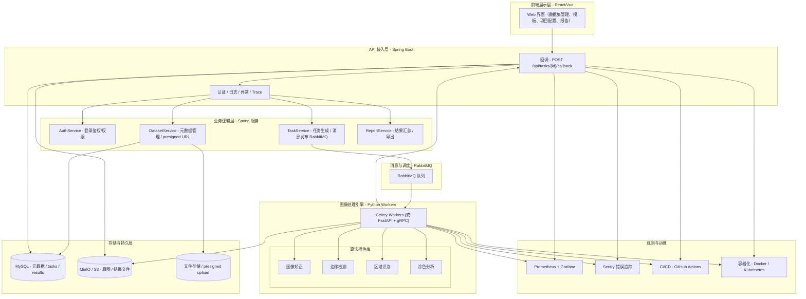
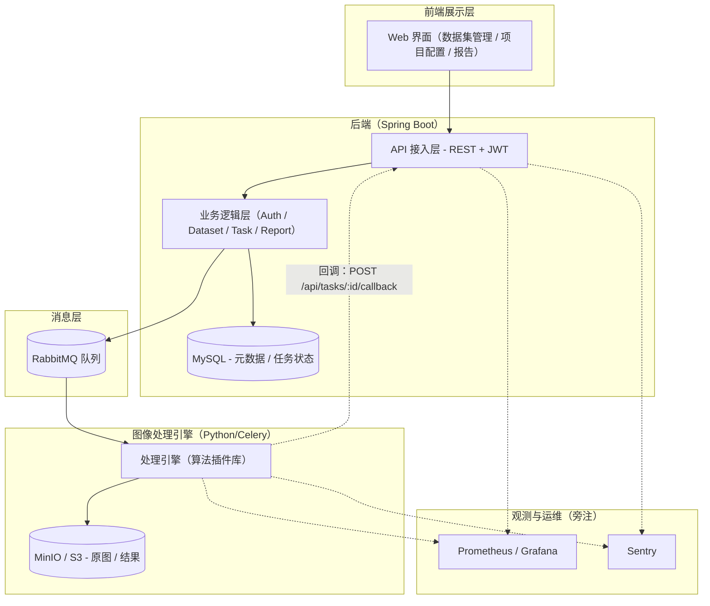
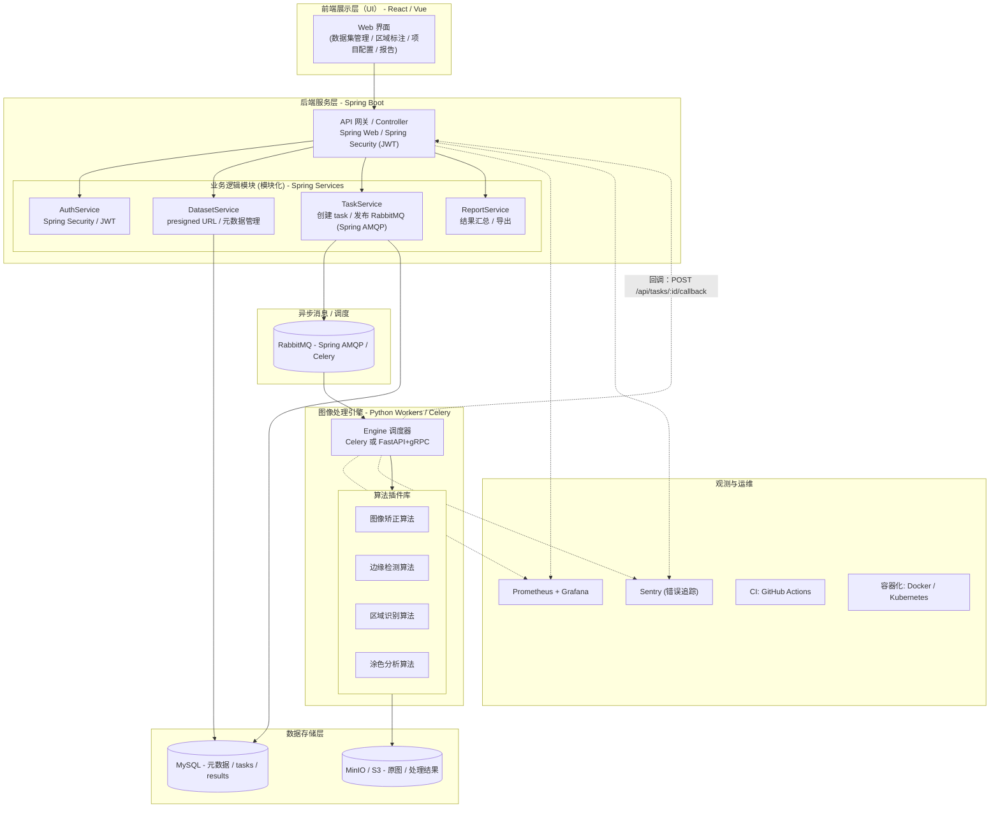
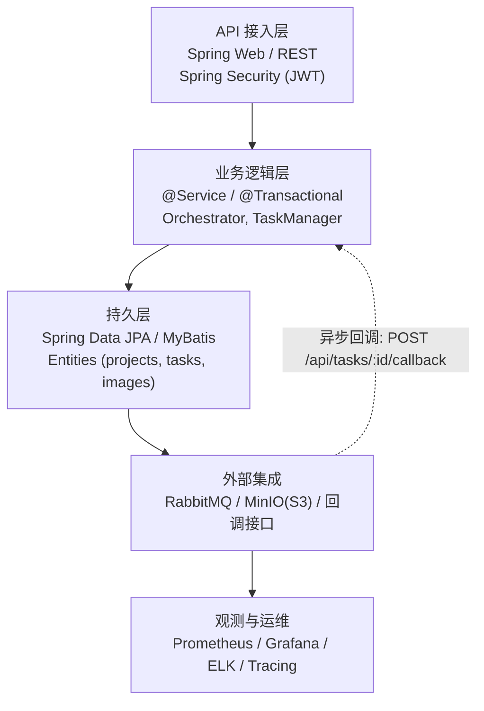
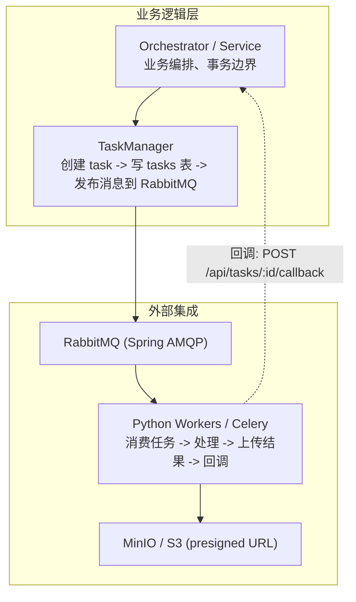

```mermaid
flowchart TB
  subgraph Client["前端展示层 - React/Vue"]
    Web[Web 界面（数据集管理、模板、项目配置、报告）]
  end

  subgraph APIGW["API 接入层 - Spring Boot"]
    API[RESTful API 网关 - Spring Web / Spring Security - JWT]
    Middleware[认证 / 日志 / 异常 / Trace]
  end

  subgraph Biz["业务逻辑层 - Spring 服务"]
    AuthService[AuthService - 登录鉴权/权限]
    DatasetService[DatasetService - 元数据管理 / presigned URL]
    TaskService[TaskService - 任务生成 / 消息发布 RabbitMQ]
    ReportService[ReportService - 结果汇总 / 导出]
  end

  subgraph MQ["消息与调度 - RabbitMQ"]
    Rabbit[RabbitMQ 队列]
  end

  subgraph Engine["图像处理引擎 - Python Workers"]
    Celery["Celery Workers (或 FastAPI + gRPC)"]
    subgraph Algorithms["算法插件库"]
      Correction[图像矫正]
      Edge[边缘检测]
      Region[区域识别]
      Analysis[涂色分析]
    end
  end

  subgraph Storage["存储与持久层"]
    DB[(MySQL - 元数据 / tasks / results)]
    ObjectStore[(MinIO / S3 - 原图 / 结果文件)]
    Files[(文件存储 / presigned upload)]
  end

  subgraph Observability["观测与运维"]
    Prom[Prometheus + Grafana]
    Sentry[Sentry 错误追踪]
    CI[CI/CD - GitHub Actions]
    DockerK8s[容器化 - Docker / Kubernetes]
  end

  %% 关系
  Web --> API
  API --> Middleware
  Middleware --> AuthService
  Middleware --> DatasetService
  Middleware --> TaskService
  Middleware --> ReportService

  DatasetService --> DB
  DatasetService --> Files
  TaskService --> Rabbit
  Rabbit --> Celery

  Celery --> Correction
  Celery --> Edge
  Celery --> Region
  Celery --> Analysis

  Celery --> ObjectStore
  Celery --> API["回调 - POST /api/tasks/{id}/callback"]

  API --> DB
  API --> ObjectStore

  API --> Prom
  Celery --> Prom
  API --> Sentry
  Celery --> Sentry

  API --> DockerK8s
  Celery --> DockerK8s
  API --> CI
  Celery --> CI

```

---

```mermaid
flowchart TB
  subgraph Frontend["前端展示层"]
    Web[Web 界面（数据集管理 / 项目配置 / 报告）]
  end

  subgraph Backend["后端（Spring Boot）"]
    API[API 接入层 - REST + JWT]
    Biz[业务逻辑层（Auth / Dataset / Task / Report）]
    DB[(MySQL - 元数据 / 任务状态)]
  end

  subgraph MQ["消息层"]
    Rabbit[(RabbitMQ 队列)]
  end

  subgraph Engine["图像处理引擎（Python/Celery）"]
    EngineCore[处理引擎（算法插件库）]
    ObjectStore[(MinIO / S3 - 原图 / 结果)]
  end

  subgraph Ops["观测与运维（旁注）"]
    Prom[Prometheus / Grafana]
    Sentry[Sentry]
  end

  %% 主数据流（突出功能）
  Web --> API
  API --> Biz
  Biz --> DB
  Biz --> Rabbit
  Rabbit --> EngineCore
  EngineCore --> ObjectStore

  %% 异步回调（虚线，强调次要交互）
  EngineCore -.->|"回调：POST /api/tasks/:id/callback"| API

  %% 观测/告警（虚线，旁注）
  API -.-> Prom
  EngineCore -.-> Prom
  API -.-> Sentry
  EngineCore -.-> Sentry
```

---

```mermaid
	  flowchart TB
	    subgraph Frontend["前端展示层（UI） - React / Vue"]
	      UI["Web 界面\n(数据集管理 / 区域标注 / 项目配置 / 报告)"]
	    end

	    subgraph Backend["后端服务层 - Spring Boot"]
	      API["API 网关 / Controller\nSpring Web / Spring Security (JWT)"]
	      subgraph Biz["业务逻辑模块 (模块化) - Spring Services"]
	        Auth["AuthService\nSpring Security / JWT"]
	        Dataset["DatasetService\npresigned URL / 元数据管理"]
	        Task["TaskService\n创建 task / 发布 RabbitMQ (Spring AMQP)"]
	        Report["ReportService\n结果汇总 / 导出"]
	      end
	    end

	    subgraph Engine["图像处理引擎 - Python Workers / Celery"]
	      Scheduler["Engine 调度器\nCelery 或 FastAPI+gRPC"]
	      subgraph Algos["算法插件库"]
	        Correction["图像矫正算法"]
	        Edge["边缘检测算法"]
	        Region["区域识别算法"]
	        Analysis["涂色分析算法"]
	      end
	    end

	    subgraph Storage["数据存储层"]
	      DB[("MySQL - 元数据 / tasks / results")]
	      Object[("MinIO / S3 - 原图 / 处理结果")]
	    end

	    subgraph MQ["异步消息 / 调度"]
	      Rabbit[("RabbitMQ - Spring AMQP / Celery")]
	    end

	    subgraph Observ["观测与运维"]
	      Prom["Prometheus + Grafana"]
	      Sentry["Sentry (错误追踪)"]
	      CI["CI: GitHub Actions"]
	      DockerK8s["容器化: Docker / Kubernetes"]
	    end

	    %% 主流程（尽量垂直，减少交叉）
	    UI --> API
	    API --> Auth
	    API --> Dataset
	    API --> Task
	    Task --> Rabbit
	    Rabbit --> Scheduler
	    Scheduler --> Algos
	    Algos --> Object
	    Dataset --> DB
	    Task --> DB
	    API --> Report

	    %% 异步回调（虚线）
	    Scheduler -.->|"回调：POST /api/tasks/:id/callback"| API

	    %% 观测/运维（旁注）
	    API -.-> Prom
	    Scheduler -.-> Prom
	    API -.-> Sentry
	    Scheduler -.-> Sentry
```

---

```mermaid
flowchart TB
  %% 主层（紧凑堆栈）
  API["API 接入层\nSpring Web / REST\nSpring Security (JWT)"]
  Service["业务逻辑层\n@Service / @Transactional\nOrchestrator, TaskManager"]
  Persistence["持久层\nSpring Data JPA / MyBatis\nEntities (projects, tasks, images)"]
  Integration["外部集成\nRabbitMQ / MinIO(S3) / 回调接口"]
  Infra["观测与运维\nPrometheus / Grafana / ELK / Tracing"]

  API --> Service
  Service --> Persistence
  Persistence --> Integration
  Integration --> Infra

  %% 异步回调（虚线，短直线）
  Integration -.->|"异步回调: POST /api/tasks/:id/callback"| Service
```

```mermaid
flowchart TB
  subgraph ServiceLayer["业务逻辑层 "]
    Orchestrator["Orchestrator / Service\n业务编排、事务边界"]
    TaskManager["TaskManager\n创建 task -> 写 tasks 表 -> 发布消息到 RabbitMQ"]
  end

  subgraph IntegrationLayer["外部集成 "]
    MQ["RabbitMQ (Spring AMQP)"]
    Worker["Python Workers / Celery\n消费任务 -> 处理 -> 上传结果 -> 回调"]
    ObjectStore["MinIO / S3 (presigned URL)"]
  end

  Orchestrator --> TaskManager
  TaskManager --> MQ
  MQ --> Worker
  Worker --> ObjectStore
  Worker -.->|"回调: POST /api/tasks/:id/callback"| Orchestrator
```
