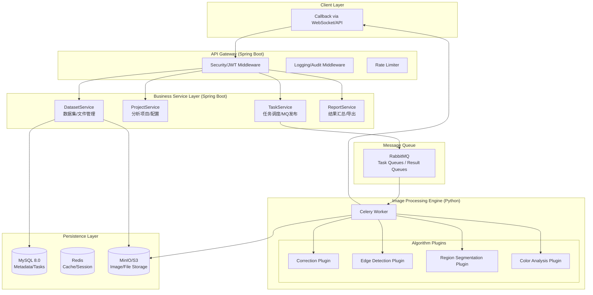
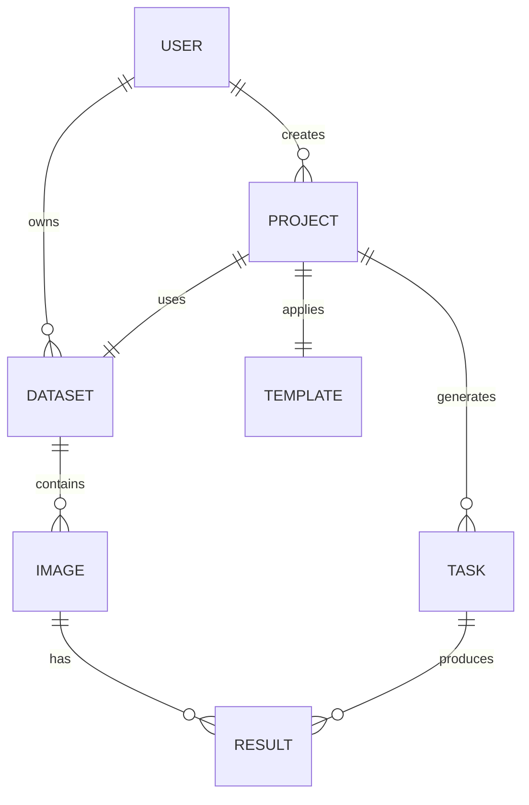

# **涂色图像分析工具 - 后端详细设计说明书**

**版本：** V1.1
**日期：** 2026年2月8日
**作者：** 陈祚垟
**跟进人：** 阮伊铭

---

## **1. 系统架构设计**

### **1.1 逻辑架构图 (Mermaid)**

---

## **2. 核心模块详细设计**

### **2.1 数据集管理模块 (Dataset Module)**

**设计目标：** 实现图像数据的高效上传、结构化存储及快速检索。

*   **上传策略：** 采用 **S3 Presigned URL**。前端向后端请求上传凭证，直接将大文件上传至 MinIO，后端仅记录元数据。
*   **文件组织：** 存储路径格式为 `/{owner_id}/{dataset_id}/{image_id}.png`。
*   **关键 API：**
    *   `POST /api/datasets`: 创建数据集。
    *   `GET /api/datasets/{id}/upload-url`: 获取预签名上传地址。
    *   `POST /api/datasets/{id}/images/batch`: 批量确认上传完成并同步元数据。

### **2.2 任务调度模块 (Task Module)**

**设计目标：** 确保图像处理任务的异步执行、状态追踪及错误重试。

*   **任务状态机：** `PENDING` -> `RUNNING` -> `SUCCESS` / `FAILED`。
*   **通信协议：** 
    *   **发布：** Spring Boot 发送 JSON 消息至 RabbitMQ。
    *   **回调：** Python Worker 处理完后调用 `POST /api/tasks/{id}/callback`。
*   **重试机制：** Celery 自动处理网络波动导致的失败，最大重试次数 3 次。

---

## **3. 数据库深度设计**

### **3.1 核心实体关系图 (ERD)**

### **3.2 关键表结构**

| 表名 | 核心字段 | 说明 |
| :--- | :--- | :--- |
| `users` | `id, username, password_hash, role` | 用户基础信息 |
| `datasets` | `id, name, owner_id, storage_prefix, file_count` | 数据集元数据 |
| `images` | `id, dataset_id, storage_key, width, height, md5` | 图像物理信息 |
| `projects` | `id, name, dataset_id, template_id, config(JSON)` | 分析项目配置 |
| `tasks` | `id, project_id, type, status, params(JSON), result(JSON)` | 异步任务追踪 |
| `results` | `id, task_id, image_id, region_id, payload(JSON)` | 细粒度分析结果 |

---

## **4. 系统集成与安全性**

### **4.1 跨语言通信 (Spring ↔ Python)**
*   **数据序列化：** 统一使用 JSON 格式。
*   **时间格式：** 统一使用 ISO 8601 (`YYYY-MM-DDTHH:mm:ssZ`)。
*   **异常处理：** Python Worker 捕获所有异常，并将堆栈信息回传至 `tasks` 表的 `logs` 字段。

### **4.2 安全性设计**
*   **鉴权：** 基于 JWT 的 Stateless 认证，Token 存储在前端 Header 中。
*   **回调校验：** 回调接口仅允许内部网络访问，或通过 HMAC 签名校验请求合法性。
*   **存储安全：** MinIO 桶设置为私有，所有访问均通过后端生成的临时签名 URL。

---

## **5. 跟进与验收标准**

1.  **接口契约验收：** 确保所有 API 的入参和出参符合 Swagger/OpenAPI 文档定义。
2.  **性能验收：** 100 张图片的批量上传及任务提交响应时间应在 2 秒内。
3.  **可靠性验收：** 模拟 Worker 崩溃，系统应能正确记录任务失败状态并支持手动重试。
